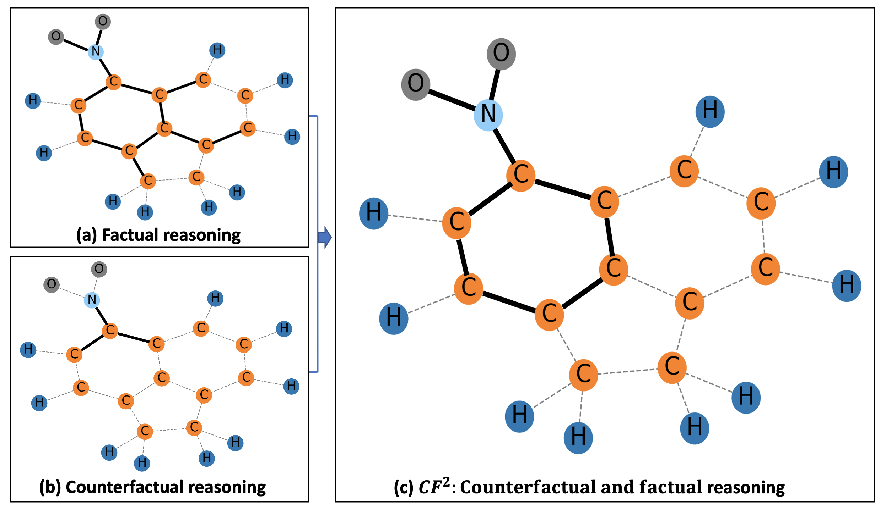

# gnn_cff
## Overall
Pytorch implementation for paper 
"Learning and Evaluating Graph Neural Network Explanations
based on Counterfactual and Factual Reasoning".


### Paper link: 
https://arxiv.org/pdf/2202.08816.pdf

## Requirements
```bash
conda env create -f env.yml
conda activate cfsqr
```

## Data & Models
Running `python scripts/setup.py` will download the datasets, pretrained models, and results into appropriate folders.

## Instruction
1. To set the python path, under the project root folder, run:
    ```bash
    source setup.sh
    ```
2. As an example, to generate explanations for node classification task (Tree-Cycles dataset as example), run:
    ```bash
    python scripts/exp_node_tree_cycles.py
    ```
    This will create a new folder in outputs/treecycles/ and save the results there.
3. The codes for training GNNs are also provided. For instance, for training GNN for node classification, run:
    ```
    python scripts/train_node_classification.py
    ```
4. To evaluate the explanations, run:
    ```bash
    python tests/tests_treecycles.py outputs/treecycles/<folder-generated-earlier>
    ```
